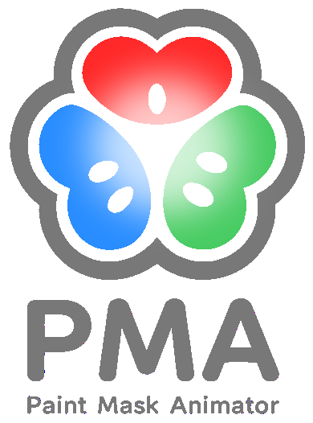

<p align="center">
  
</p>

# PaintMaskAnimator

[English](README.en.md) | 日本語

[](https://github.com/SehataKuro/PaintMaskAnimator/actions/workflows/ci.yml)
[](https://github.com/SehataKuro/PaintMaskAnimator/releases)
[](https://www.python.org/)
[](https://doc.qt.io/qtforpython/)
[](https://jokomanato.com/paintmaskanimator/downloads/)
[](LICENSE)

PySide6 で作られたペイント / マスクアニメーションツールです。
略称は **PMAn**（ピーマン）。

## 関連リンク

- [ダウンロードページ](https://jokomanato.com/paintmaskanimator/downloads/)
- [機能検証マップ（各コミットのテスト結果から自動更新）](https://jokomanato.com/paintmaskanimator/)

ページの閲覧には Basic 認証が必要です。

- ユーザー名: `guest`
- パスワード: `6eCKEq`

## プロジェクトの由来と開発思想

PaintMaskAnimator は、[小嶋慶祐](https://x.com/kkeisuke220)が v0.5 まで単独で
開発しました。v0.5 以降は、小嶋慶祐と上甲愛士の 2 名による共同開発として継続して
います。

当初から一貫している開発の狙いは次のとおりです。

- PaintMan に代わり得るアニメーション仕上げソフト
- 動画作業にも対応できる描画能力
- CLIP STUDIO PAINT のような操作感を持つタイムライン

現在もこの方向性のもとで開発を進めています。

## 必要環境

- Python 3.10 以上
- PySide6、PySide6-QtAds、numpy（必須）／Pillow、psd-tools（任意。追加の読み込み・書き出し機能が有効になります）

```bash
pip install -r requirements.txt
```

## 実行

```bash
python PaintMaskAnimator.py
```

またはモジュールとして：

```bash
python -m paintmaskanimator
```

## 表示言語

日本語（原文）と英語に対応しています。**表示 › 言語 / Language** から選択でき、
既定ではOSのロケールに従います。切り替えは次回起動から反映されます。

翻訳は `paintmaskanimator/translations/` の Qt `.ts` カタログで管理しています。
`tr()` の文字列を追加・変更したら
`python scripts/update_translations.py` で再生成してください（CIが鮮度を検証します）。

## 開発

```bash
pip install -r requirements-dev.txt
QT_QPA_PLATFORM=offscreen python scripts/run_tests.py -q
```

テストはヘッドレス（オフスクリーン Qt）で実行されます。CI は push のたびに実行されます。

## プロジェクト構成

アプリケーションは [`paintmaskanimator/`](paintmaskanimator/) 以下の Python パッケージです：

| モジュール | 役割 |
| --- | --- |
| `document.py` | プロジェクト状態モデル（フレーム / レイヤー / カーソル、スナップショット） |
| `imaging.py`、`geometry.py`、`colors.py`、`color_ops.py` | Qt に依存しない純粋なアルゴリズム |
| `project_io.py` | プロジェクト（`.zip`）の保存 / 読み込みシリアライズ |
| `canvas.py`、`timeline.py`、`toolpanel.py`、`main_window.py` など | UI レイヤー（PySide6 ウィジェット） |
| `main_window_<topic>.py` | 機能ごとのコントローラ（`window.export` など、`MainWindow` が所有） |
| `progress.py` | 長い処理で共有する進捗カウンター |
| `i18n.py` | 翻訳の読み込みと `tr()` |
| `errors.py` | 例外型と、ユーザー操作ハンドラが捕捉する範囲 |
| `dependency_check.py`、`optional_deps.py` | 必須依存の起動時チェックと、任意依存のフォールバック |
| `bucket_fill.py` | バケツの領域判定（UI 非依存）。単発の塗りと串刺し塗りが共有する |
| `frame_scope.py` | 全コマ一括適用のランナー（進捗・中断・Undo のまとめ） |
| `mcp/` | MCP サーバーと導入補助。AI クライアントから `.pma` を操作する（任意依存） |
| `mcp_dialog.py` | 「MCP サーバー設定…」ダイアログ（診断・設定生成・登録） |

リポジトリ直下の `PaintMaskAnimator.py` は薄いランチャーです。

## Python アクション

アクションパネルは、Python スクリプトからカスタムボタンを追加できます。アクション
パネルのタブ左端の **☰ → スクリプトを編集** でアプリ内エディタが開き、スクリプトの作成・
編集・再読み込みが行えます。各スクリプトは次の関数を公開します：

```python
def register_actions(panel, window):
    panel.add_action(
        "my.unique.action",
        "My Action",
        lambda: window.status_bar.showMessage("Done", 3000),
        tooltip="Optional help text",
    )
```

書き方・API リファレンス・組み込みアクションの一覧・トラブルシューティングは
[`docs/actions.md`](docs/actions.md) にまとめています。サンプルは
[`examples/actions/hello_status.py`](examples/actions/hello_status.py) を参照して
ください。アクションスクリプトは通常の Python コードなので、信頼できる提供元から
のみインストールしてください。

## MCP サーバー（任意）

AI クライアント（**Claude Desktop / Claude Code / Codex CLI**）から `.pma`
プロジェクトを読み、コマを画像として受け取り、線で閉じた領域に色を置けます。
**PMAn 側に AI は入りません。** 推論はクライアント側にあるので、API キーも
ネットワークも持ちません。

導入はアプリの **ヘルプ › MCP サーバー設定…** から行えます。導入状況が診断され、
設定の生成と Claude Desktop への登録がボタンで済みます（JSON を手で書く必要は
ありません）。Claude Code 用のワンライナーもコピーできます。

コマンドラインからも同じことができます。

```bash
pip install -e ".[mcp]"
python -m paintmaskanimator.mcp --doctor                  # 導入状況を確認
python -m paintmaskanimator.mcp --install                 # Claude Desktop へ登録
python -m paintmaskanimator.mcp --install --client codex  # Codex CLI へ登録
```

既定は読み取り専用です。書き込みには `--allow-write` を付けます。ツール一覧・
制限・設定を壊さないための約束は [`docs/mcp.md`](docs/mcp.md) を参照してください。

## ライセンス

PaintMaskAnimator は **Apache License 2.0** のもとで配布されます。全文は
[`LICENSE`](LICENSE) を、帰属表示は [`NOTICE`](NOTICE) を参照してください。

```
Copyright (c) 2026 PaintMaskAnimator contributors

Licensed under the Apache License, Version 2.0 (the "License");
you may not use this file except in compliance with the License.
You may obtain a copy of the License at

    http://www.apache.org/licenses/LICENSE-2.0

Unless required by applicable law or agreed to in writing, software
distributed under the License is distributed on an "AS IS" BASIS, WITHOUT
WARRANTIES OR CONDITIONS OF ANY KIND, either express or implied.
```

商用・非商用を問わず、利用・改変・再配布が自由に行えます。改変版をクローズド
ソースの製品として配布することもできます。求められるのは、ライセンス表記と
`NOTICE` の保持、および変更点の明示だけです（Apache License 2.0 第4条）。

本ソフトウェアで作成した作品（画像・アニメーション・プロジェクトファイル）は
あなたのものです。ライセンスは作品には及びません。

### 商標について

Apache License 2.0 は商標の使用を許諾しません（第6条）。「PaintMaskAnimator」
および略称「PMAn」は、派生物の名称としては使用しないでください。

### サードパーティライセンス

本アプリは PySide6（LGPLv3）、Qt Advanced Docking System（LGPL-2.1）などを
利用・同梱しています。**これらの LGPL 義務は本プロジェクト側にあります。**
配布物やパッケージング（PyInstaller の設定など）を変更する場合は、必ず
[`THIRD_PARTY_LICENSES.md`](THIRD_PARTY_LICENSES.md) の「LGPL compliance」節を
確認してください。

### 貢献について

貢献の手順は [`CONTRIBUTING.md`](CONTRIBUTING.md) を参照してください。貢献は
Apache License 2.0 の条件で提供されたものとみなします（同ライセンス第5条）。
別途の同意書（CLA）は不要です。
